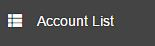
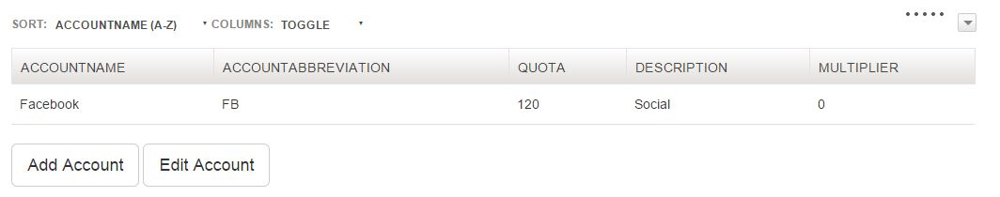
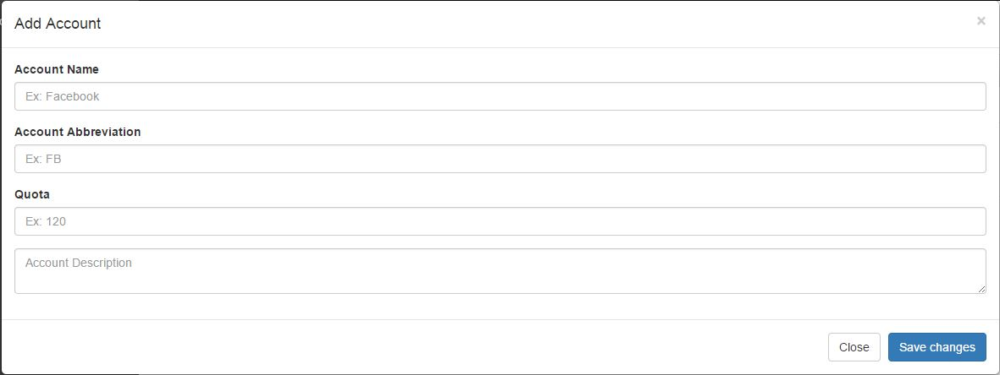
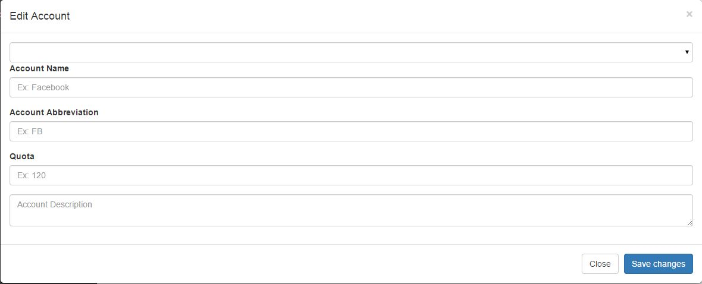
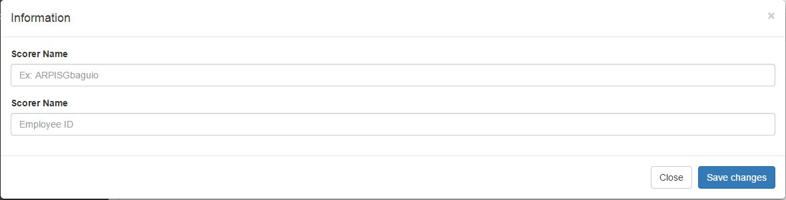

# Accounts

>
>Select Accounts on upper right of the screen to be able to add and edit account, and view employee account.
>
## Account List

>

>
> + Click Account List on the left side of the screen to be able to add and edit an account.
>

> 
> + Clicking Add account button will let you fill up a form in adding an account.
>

> 
> + Clicking Edit account button will let you fill up a form in editing an account.
>
>
## Account Viewer

>

>
> + Click Account Viewer on the left side of the screen to be able to view details of an account, edit functionality is enabled accordin to access level.
>

>
> + Click Button to asign agent to a particular account and team leader.