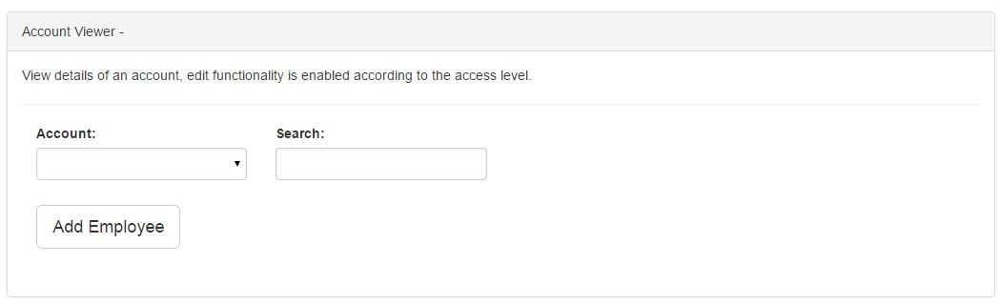

# Accounts

>
>Select Accounts on the upper right of the screen to be able to add and edit account, and view employee account.
>
## Account List

>

>
> + Click Account List on the left side of the screen to be able to add and edit an account.
>

> 
> + Clicking Add Account Button will let you fill up a form in adding an account.
>

> 
> + Clicking Edit Account Button will let you fill up a form in editing an account.
>
>
## Account Viewer

>

>
> + Click Account Viewer on the left side of the screen to be able to view details of an account. Edit functionality is enabled according to access level of the user.
>

>
> + Click Save Changes Button to assign an employee to a particular account and Team Leader.