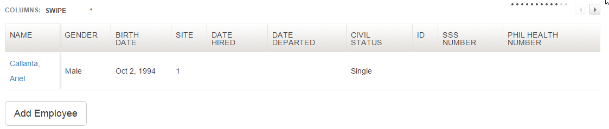
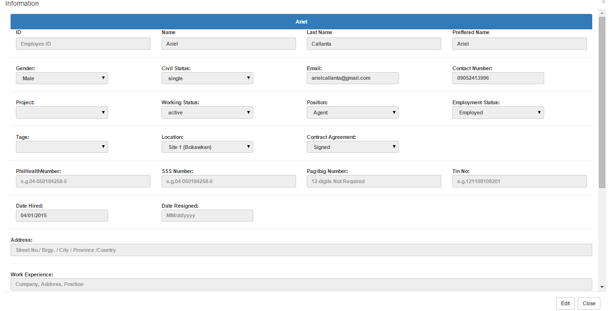
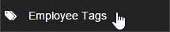
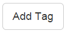
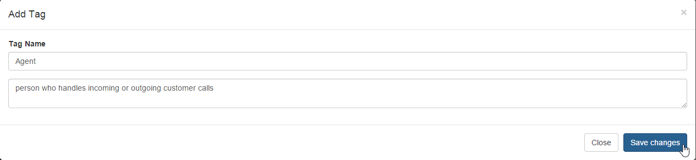
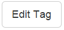
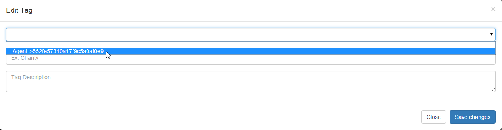
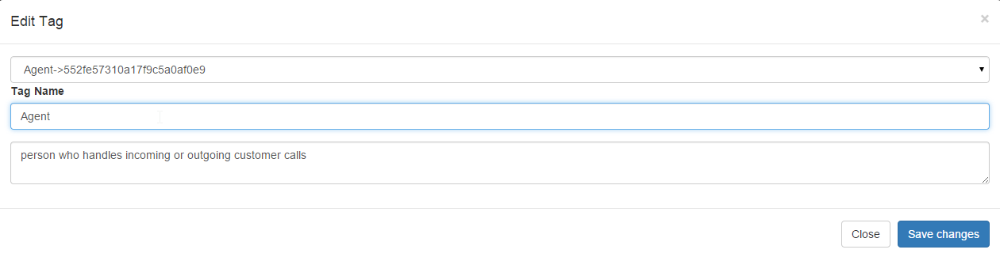

# Personnel

>
>
Select Personnel on upper right of the screen to be able to view employee list, add employee, add and edit position, add and edit tag.
## Add Employee

>
> 
+ Click Add Employee on the left side of the screen to be able to add an employee.
>

>
> 
+ You can add image on the form by clicking the Upload Picture or Select Image.
> 
+ Fill up the form most especially the required fields with valid data.
> 
+ Required Fields are the following:
	+ Last Name
	+ First Name
	+ Birthdate
	+ Gender
	+ Civil Status
>

>
> 
+ You can also add multiple dependents, experience, and character reference by clicking the add button as well  as deleting it if you wish too.
>

>
> 
+ Finally Click Save button to submit the form. Clear button is also provided to reset the form back to its original phase.
	
## Employeelist
+ For you to view the latest employee list navigate first to Personnel on the upper middle right and click
>

>
and this will show you..
>

>
+ To edit the information of a specific employee you should click the name of the employee from the list and this will prompt
>

>
and click edit button to enable the field dont forget to save your edits!.

	
## Position List

>
> + Click Position List on the left side of the screen to be able to add and edit a position.
>

>
> + Click add position button to add a position. Fill up the form with corresponding information. Then finally click Save Changes or cancel.
>

>
> + Click edit position button to edit a position. Fill up the form with corresponding information. Then finally click Save Changes or cancel.
>
## Employee Tags

>
Employee Tags is for adding and editing a tags and for you to add and edit a tag follow this steps:
>

>
>
+ Click add button and this will be the next interface

>
>
+ Fill up all the fields and dont forget to hit SAVE button. 
>
And this will be the result after hitting save button.
>

>
>

>
+ Click edit button to edit the current tags in the list and select specfici tags that you want to edit.

>
>
+ Edit the field that you want to edit and dont click save.
>

>

