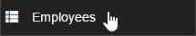
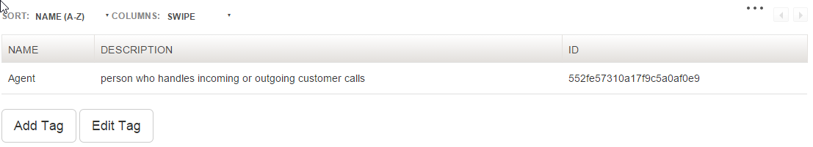

# Personnel

>
>Select Personnel on upper right of the screen to be able to view Employee List, Add Employee, Add and Edit Position, Add and Edit edit tag.
## Add Employee

>
> + Click Add Employee on the left side of the screen to be able to add an employee.
>

>
> + You can add image on the form by clicking the Upload Picture or Select Image.
> + Fill up the form most especially the required fields with valid data.
> + Required Fields are the following:
	+ Last Name
	+ First Name
	+ Birthdate
	+ Gender
	+ Civil Status
>

>
> + You can also add multipe Dependents, Experience, and Character Reference by clicking the Add button. You can also delete it as you wish.
>

>
> + Finally Click Save button to submit the form. Clear button is also provided to reset the form back to its original phase.
	
## Employeelist
+ For you to view the latest Employee List, first navigate the Personnel on the upper middle right and click .. and this will appear.
>

>
and this will show you..
>

>
+ To edit the information of a specific employee, click the name of the employee from the list and this will appear.
>

>
and click Edit bBtton to enable the field. Don't forget to save your edits.

## Position List

>
> + Click Position List on the left side of the screen to be able to add and edit a position.
>

>
> + Click Add Position button to add a position. Fill up the form with corresponding information. Click Save Changes to save the information you created or Close.
>

>
> + Click edit position button to edit a position. Fill up the form with corresponding information. Then finally click Save Changes or cancel.

## Employee Tags

>
Employee Tags is for adding and editing a tag. To add and edit a tag follow this steps:
>

>
>
+ Click Add Tag and this will appear.

>
>
+ Fill up all the fields. Don't forget to Save Changes.
>
This will be the result after saving changes.
>

>
>

>
+ Click Edit Tag to edit the current tags in the list. Select specific tags that you want to edit. 

>
>
+ Edit the field you want to edit. Click Save Changes.
>

>

