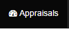
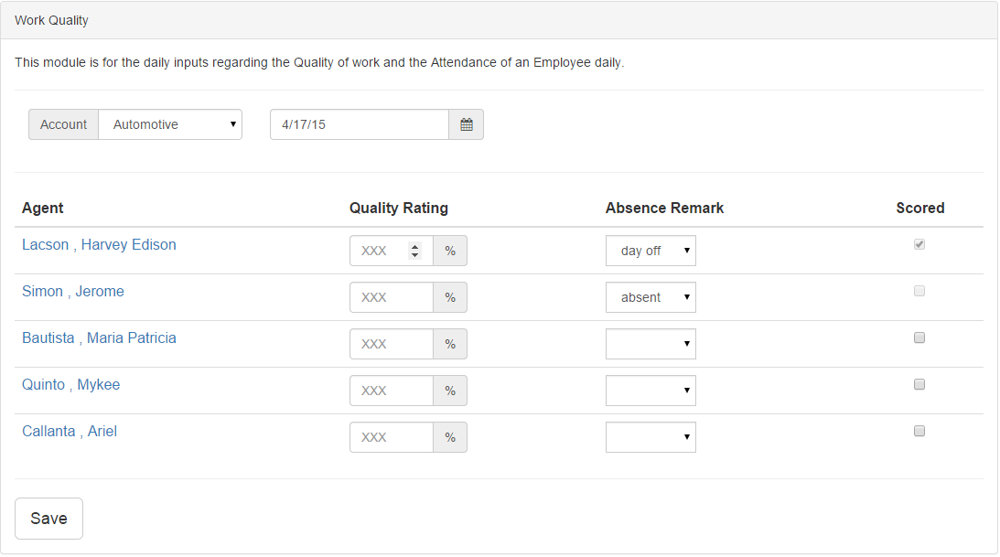
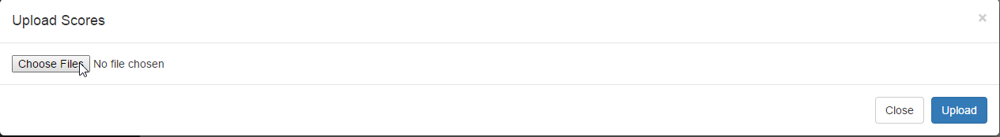
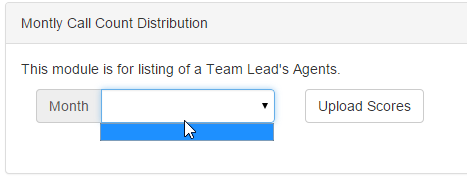
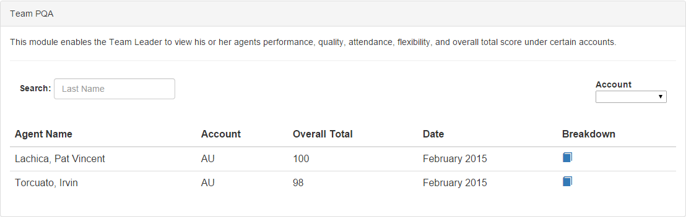
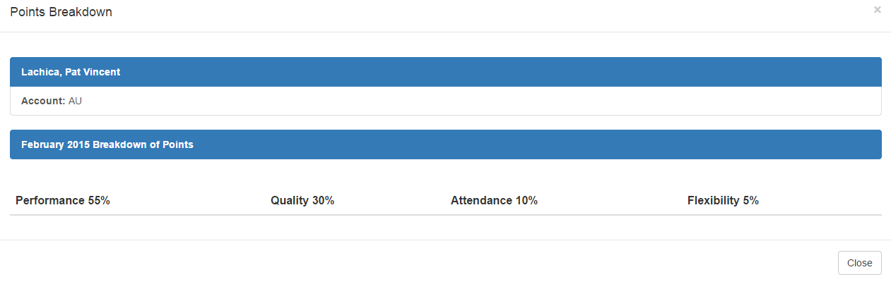

# Appraisals
For you to appraise an employee click appraisals button on the top right.
>

>
and click A & Q,  A for Attendance and Q for the Quality work of an employee
>

## Attendance and Quality
This module is for daily inputs regarding the Quality of work and the attendance of an employee daily.

>
after clicking A & Q this will you on your screen
>

>
+ You can select an account to appraise employee, agent on that specific account
	+ You can only rate the quality of work form 1-100
	+ To mark the absent you can select:
		+ present
		+ absent
		+ day off
+ You can select the check button in scored if you already scored the employee

## Performance
This module is for listing of teamleads agents.
>

>
+ Uploading facility that uploads the daily scores of an agent. This will only accept a CSV file.
>

>
+ To view the Monthly call counts distrubution you may select specific month to view the call counts of every months uploaded.
>

## Team PQA
This module enables the team leader to view his/her agents performance, quality, attendance, flexibility, and overall total score under certain accounts.
>

>
+ Team Leader oversee all PQA of his/her agents agents.
+ Use search function to search a specific agents.
+ Use the dropdown menu on the right side to select an account to list all agents on that accounts.

>

>
+ To view the breakdown or summarized PQA of a specific agent click the blue button of the breakdown column and it will diplay..
>

	
	